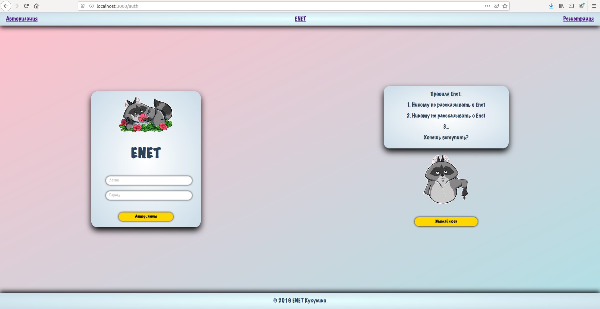
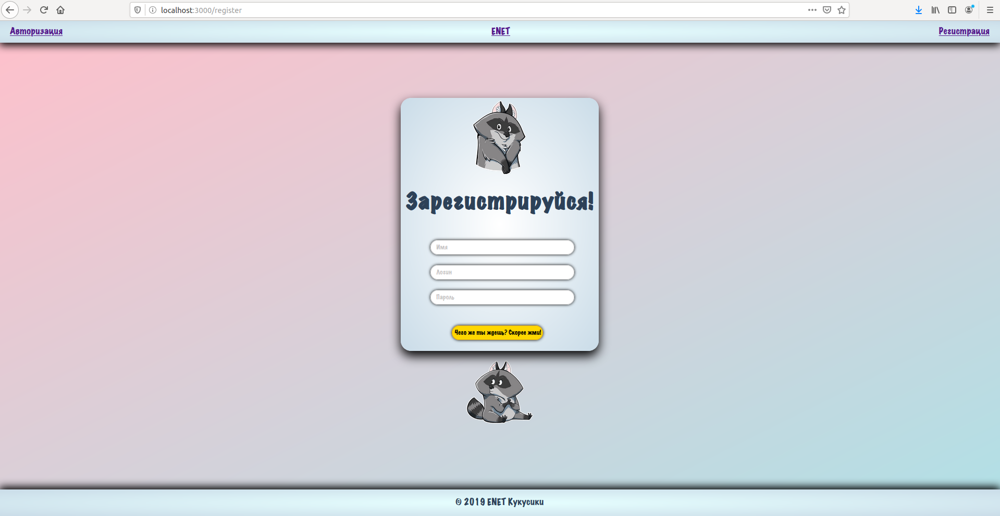
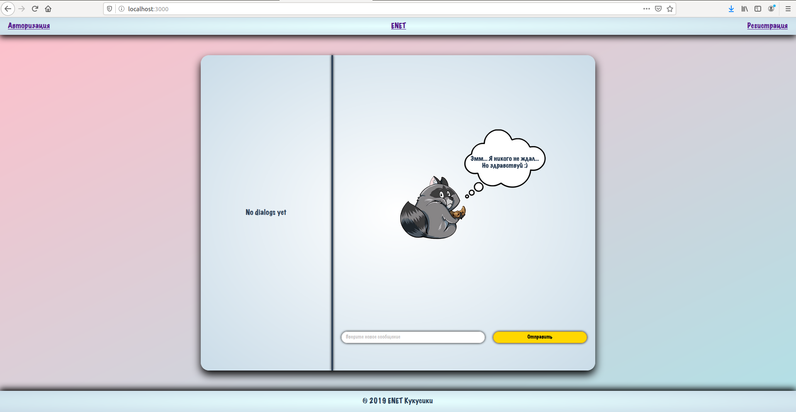

# Лабораторная работа №6.

## Available Scripts

В этой директории можно запустить:

### `npm start`
```git clone https://github.com/Neprincessa/Mephi_sem5 npm start```
Запуск приложения.<br />
Открыть [http://localhost:3000](http://localhost:3000), чтобы посмотреть в браузере.

## Описание:
Заготовка для социальной сети. <br/>
Регистрация по почте, имя пользователя на кириллице, пароль от 6 символов.

## Задействовано:
1. Стилизация компонентов с помощью css modules
2. Использование flex
3. Использование react-router


***

## Пример работы:
Страница авторизации: 


Страница регистрации:


Домашняя страница (страница авторизованного пользователя с его сообщениями): 

